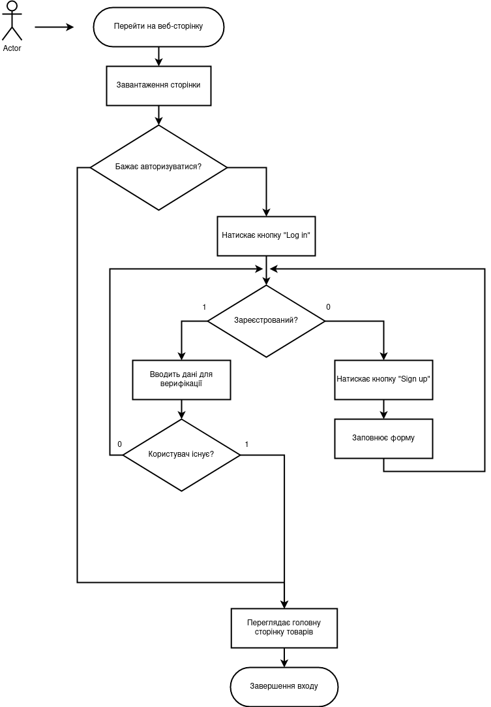
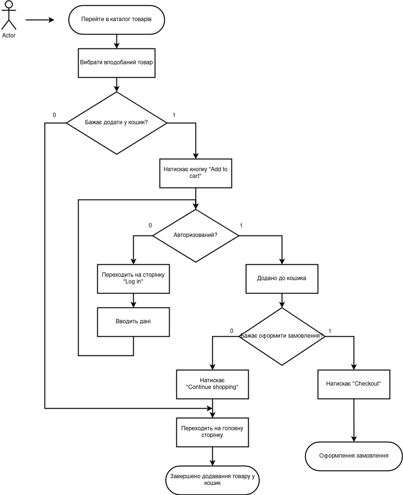
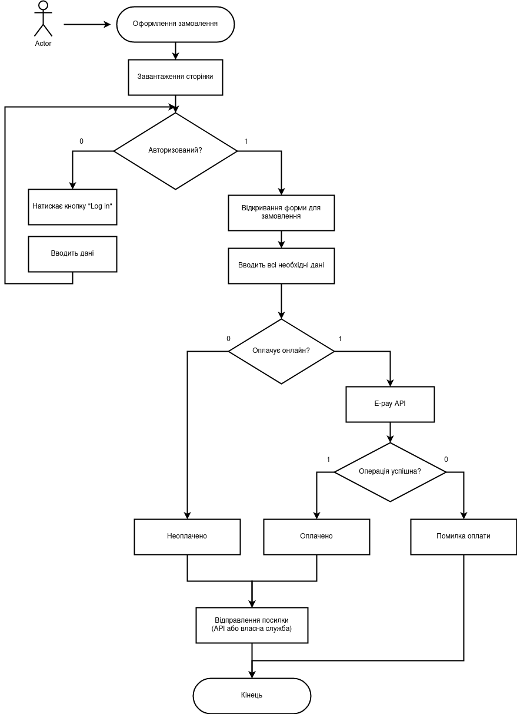
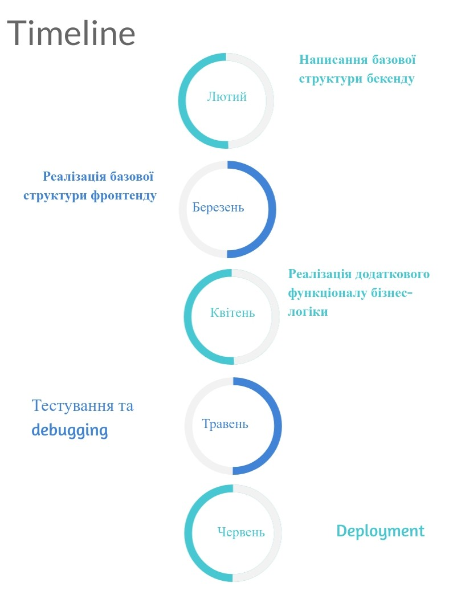

# Online Store

## Опис проекту:
Даний проект є інтернет-магазином. Веб-сервер надасть можливість здійснення перегляду наявних товарів та формування замовлень в режимі онлайн.
Користувач додасть бажані товари у кошик, введе необхідну інформацію для відправлення товарів та оплатить картою (або ж оформить оплату при отриманні).

## Актуальність проекту:
На мій погляд, продукт буде актуальним, бо у людей завжди є потреба купувати товари онлайн. Особливо, якщо товар імпортний та його неможливо знайти на місцевих прилавках.

Подання асортименту в інтернеті — це перспективний напрямок розвитку бізнесу. Для цього достатньо буде невеликого стартового капіталу. Згодом магазин може стати основою для подальшого розширення компанії.
Також, віртуальний магазин не потребує вихідних і перерв, відвідувачі можуть оформляти замовлення в будь-який зручний час. 

## Функціонал продукту:
**Незареєстрованим** користувачам доступний функціонал перегляду асортименту товару, вибравши потрібну категорію або за допомогою пошуку.Окрім цього, буде доступна фільтрація та сортування.

**Зареєстрованим** користувачам окрім того, що доступне незареєстрованим користувачам, буде реалізований доступ до персонального кошика (куди додаватимуться бажані товари) та здійснення покупки (формування замовлення).
Також можна буде залишити коментар про товар.

**Адміністратор** матиме змогу додавати нові товари, категорії, тощо. Також у нього буде доступ до сформованих замовлень. Тобто буде доступ до керування бізнес-проектом. 

---

На головній сторінці будуть:

- кнопка реєстрації/входу
- кнопка персонального кабінету
- пошук по назві товару
- категорії товару
- фільтрація
- сортування
- головне поле (товар, який задовільняє критерії пошуку або категорії)

---

## Стек технологій:

### Backend: Django 
 
Даний фреймворк написаний на Python. Його дуже зручно використовувати для розробки веб-сайтів, котрі працюють із базами даних. 

#### Переваги: 
- Адміністративна панель

Адміністративна панель Django автоматично генерується при створенні програми. Це позбавляє розробника від необхідності створювати адмінку вручну. За допомогою сторонніх додатків консоль управління Django можна вдосконалити і адаптувати для потреб свого проекту.

- Можливість розширення

Функціональність Django розширюється за допомогою плагінів. Це програмні модулі, які дозволяють швидко додати на сайт потрібні функції із сторонніх API.

- Бібліотеки

Django підтримує використання бібліотек при розробці веб-додатків. У число популярних бібліотек входять:

-Django REST Framework, який спрощує роботу з API.
-Django CMS - зручний інструмент для управління контентом.
-Django-allauth - з його допомогою реалізуються функції реєстрації, авторизації, управління обліковими записами.

### База даних: PostgreSQL

Вибір БД постав серед PostgreSQL та MySQL.
Проте, краще все ж обрати PostgreSQL, тому що він швидший. Також PostgreSQL має дуже обширний список даних, котрий набагато більший від MySQL, також PostgreSQL має підтримку JSON, що може знадобитися.
До того ж є певний досвід роботи із PostgreSQL.

Більше того, самі розробники Django рекомендують PostgreSQL:
If you're not tied to any legacy system and have the freedom to choose a database back-end, we recommend PostgreSQL, which achives a fine balance between cost, features, speed and stability. (The Definitive Guide to Django, p. 15)

### Frontend: React

Вибір стояв поміж React та Angular. Обидва є є найбільш популярними технологіями у сфері front-end розробки.
Порівняння:

- Архітектура. За архітектурою Angular є повноцінним MVC фреймворком, який надає розробникові всі можливості для програмування “з коробки”: шаблони, засновані на HTML; впровадження залежності (Dependency injection); запити Ajax; роутінг; інкапсуляція компонентів CSS; утиліти для тестування компонентів; можливості для створення форм тощо.   На відміну від Angular React є бібліотекою, яка надає тільки View. а як реалізувати Model і Controller віддається на розсуд розробника. “З коробки” надаються тільки такі можливості: замість шаблонів використовується XML-подібна мова JSX, як надбудова над JavaScript; немає впровадження залежностей; запити Ajax; утиліти для тестування компонентів.

- React використовує так званий віртуальний DOM. Віртуальний DOM розглядає лише відмінності між попереднім та поточним HTML та змінює частину, необхідну для оновлення. Це може значно пришвидшувати роботу веб-додатку.

- У Angular розмітка документу (шаблони HTML) і логіка (JavaScript) фізично розділені на різні файли. React використовує мову JSX, яка поєднує розмітку та логіку в одному файлі (полегшує читання компонентів).

У якості фронтенду все ж я обрала React, бо це найоптимальніший  варіант для даного веб-додатка, який буде швидко працювати за рахунок Virtual DOM, що ефективно працює із пам'яттю.
Також, швидкість написання коду буде більшою, оскільки він простіший  за Angular,.

## Діаграма входу на веб-сайт

---

## Діаграма додавання товару у кошик

---

## Діаграма оформлення замовлення

---

## Timeline

---
Яшан Оксана
